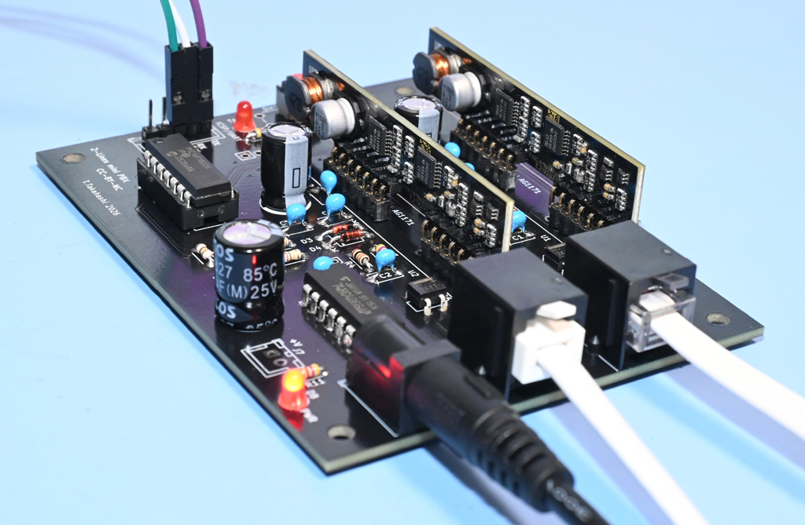
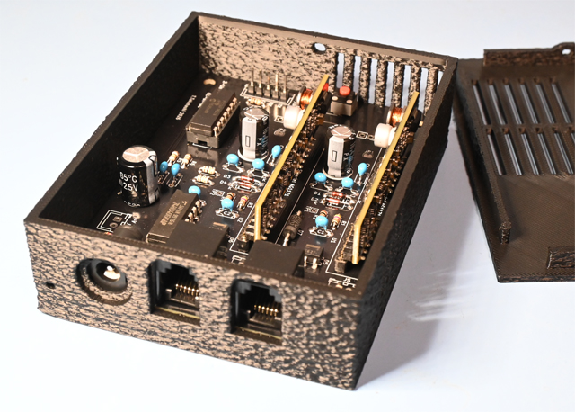

# 2回線ミニPBX




## これは何？

2回線のPBX、つまり電話交換機ですが電話機2台が接続できるだけです。要するに1:1で通話ができるPBXです。

アナログ電話機でダイヤルパルス専用です。ですので、主に黒電話等が対象となりますが、ダイヤルパルスモード(DP)が使える電話機なら使うことができます。

1:1の交換機なので用途としてはインターフォン的にしか使えませんが、ホットライン機能も備えているため、受付電話なんかにも使えるかもしれません。黒電話の動体展示にも使えると思います。

SLICモジュールの回線インタフェース側はデータシート通りの実装になっているため各電話機までは1km程度まで配線を伸ばせるはずですが、さすがに1kmもの距離は試験していません。

秋月(トライステート)の簡易交換機なき今、困っている人もいるかもしれませんので、そんな人にお勧めです。モデムとかFAXの試験用の疑似交換機、売ってはいますけどね。

※ VSCodeでのPIC開発環境の公開方法がよくわかっていないので、もし足りないファイル等があればご連絡ください。VSCodeでMCCを使ったPICの開発環境、あまりにも便利なので開発がめちゃめちゃ進む一方、MCCのUpdate等で挙動の変化に振り回されたりもしています。

## ライセンス

うるさいことは言いません。好き勝手に使ってください。ですが改変する場合には継承していることを示すようにしてください。とはいえ、商用利用(製品化・キット化・講習会含む)は禁止します。商用利用したい場合には別途お問い合わせください。

なお、ソースコードの作成には生成AI(Google Wrokplace版のGemini)を使用しています。

## 簡単な回路説明

回路図はルートにPDFで置いてあります。

SLICモジュール2枚をPIC 16F18326(14ピン)で制御し、ダイヤルパルスによって番号を取得し、繋ぐ、フック状態によって切断等の処理を行っています。SLICモジュールの制御信号は3ピンあるのでPICの6ピンは制御専用です。

呼が成立するとSLICモジュールのVin Vout(音声入出力)を相手SLICのVout Vinと繋ぐことで通話を成立させます。これにはアナログスイッチ、4066を使用しています。

SLICの出力(Vout)はDCバイアスされているので、R1,R2とR3,R4で4066のmid-railになる(2.5v)ようにします。このためC1,C2は不要なのですが(ショートさせる)、もともと別回路から持ってきた回路図だったので、Cが入ってしまったままの回路で基板製造をしてしまったので、回路図にも基板にも残っています。使用する際にはショートしておいてください(CでカットしてスイッチにDCバイアスかかってないのを見落としてた！)。

接続自体はようするに単純な1:1なので、繋ぐか繋がないかの処理しか行いません。1:1しか通話しないので、音声は繋ぎっぱなしでもかまわないといえばかまわないのですが、それでは面白くない(双方で受話器を上げたら相手の声が聞こえてしまう)ので通話の接続と切断を行っています。

PICのRA4,RA5はPIC内部でNCOの出力が割り当てられており、400Hzのトーンを出力します。RA4がLine 1、RA5がLine 2側のトーン源として動作します。PICのピンをオン/オフすることでトーンの出力や停止、RBT音の生成を行います。

トーン出力はパルスのため、「それらしい」音になるように100kΩと0.01uFのLPFを通しています。カットオフポイントは計算上160Hz付近ですが、こんなもんでまあまあ良い感じです。これを100kΩの抵抗を介して、SLICのVinに注入することで、電話機に対してトーンを聞かせるようになっています。もしトーンの音量が大きすぎる、あるいは小さすぎる場合にはR7,R9の抵抗を調整してください。

ICSP(Snap/PICkit)用のピンはPGC/PGDをEUSARTと兼用しています。要するにICSPを外したピンのところにUSB-UART等を接続すればシリアルコンソールとして使えます。

## BOM

|部品番号|数量|値|備考|
|-----|-----|-----|-----|
|C1,C2|0|なし|基板上でショートしてください|
|C3,C4,C7,C8,C11,C12,C13,C14|10|0.1uF|5mm幅|
|C5,C6|2|0.01uF|5mm幅|
|C9,C10,C15|3|470uF|16V電解|
|D1,D2,D3,D4|4|BAT43|ショットキーバリアダイオード|
|D5,D6|2|S1ZB60|ダイオードブリッジ|
|D7|1|P6KE82|ESD保護ダイオード|
|D8,D9|2|LED|3mmの適当なもの|
|R1,R3|2|4.7k|1/6W|
|R2,R4,R8|3|10k|1/6W|
|R5,R6,R7,R9|4|100k|1/6W|
|R10,R11|2|2.2k|1/6W LEDの電流制限なので適当に調整|
|SW1|1|MCLR用|適当なもので|
|U1,U2|2|AG1171|SLICモジュール|
|U3|1|PIC 16F18326|DIP 14ピン ソケット|
|U4|1|74HC4066AP||

パーツ類はすべてスルホール品です。スルホールだけで構成しており、手ハンダで工作できるようにしています。

このプロジェクトではC1,C2は不要なので基板上で抵抗のリード等でショート(0Ω)しておいてください。

J1はICSP用(MPLAB Snap)ですので、通常はピンヘッダでかまわないと思います。基板のフットプリントはJST XHの5ピンで確保してあります。

J2,J3は秋月で売っているRJ-25(6ピン)のモジュラージャックが適合しますが大体のものは合うと思います。実際に使っている線数はL1/L2の2線だけなのでRJ-25である必要はありません。
もし、基板からモジュラー配線を直接行わないのであればJ5,J6が回線引き出し用として使えます。こちらもJST XHサイズで用意してあります。

J4は2.1mmのDCジャック、プリント基板用が使えます。こちらももし、基板上にDCジャックを設けない場合にはJ7がパワーコネクタになります。電源電圧の想定はDC 5Vなので5VのACアダプタ(1A以上)を使ってください。

D8,D9,R10,R11はインジケータのLED用なので必要なければ付けなくてかまいません。D8は電源表示、D9は通話中表示用です。

ほとんどの部品は秋月電子で揃います。ですが、SLICモジュールとESD保護ダイオードは国内で調達するのが難しいのでMouserあたりで買ってください。

AG1171S

https://mou.sr/4fQpmxW

P6KE82

https://mou.sr/44frmJ0

ESD保護ダイオードの方はツェナーでもかまわないのですが、AG1171のデータシートで指定されているBZT03C82が、ツェナー電圧82Vなので、これまた国内で入手するのがちょっと面倒そうなので、もしSLICモジュールをMouserから買うならESD保護ダイオードもいっしょに買ってください。このダイオードは"per line card"なので、複数のSLICモジュールに対して1つでかまいません。

SLICモジュールを基板に直接ハンダ付けしたくない場合には秋月で売っているショートのピンソケットが使えます。

シングルピンソケット (低メス) 1×20 (20P)

https://akizukidenshi.com/catalog/g/g103138/

AG1171がちょっと短足なので普通のピンソケットは使えません。

上記のパーツ以外に、もし自分でプログラムを修正して書き込みたい場合にはICSP(MPLAB SnapかPICkit)と開発環境が必要になります。このプロジェクト自体の開発はVSCode + MPLAB extension + MCCで行っています。

またシリアルコンソールを使う場合にはUSB-UARTが必要となります。TTLレベルのものを用意してください。ICSPの3,4,5番ピンがシリアル接続用です。

基板を製造する場合にはルートにある2lines-pbx.zipをお使いください。このデータで基板製造ができるはずです。サンプル写真に使っている基板はJLCPCBで製造したものです。

抵抗のフットプリントが小さめになっています。もし適合する抵抗がないのであれば立てて実装してください。SLICモジュール自体の高さが結構あるので、抵抗を縦に実装しても問題はないでしょう。


# ケース

3Dプリントして使えるケースを用意してあります。



https://www.thingiverse.com/thing:7373621

注意：フタ(top)側は固定爪の出力の関係でサポート有でスライスしてください。ちょっとした部分ではあるのですが、サポート無しにはできなかったので。
本体側(bottom)はサポート無しでも大丈夫です。

セルフタップネジがあるときっちり組み立てできます。
ファジースキンで仕上げると良い感じになります。

## 使い方

組み立ててプログラムを書きこんだら使えます。たぶんね。

単純に書き込んで使うだけなら.hex(out/Mini-PBX/default.hex)を使ってください。


Line1(Port1)とLine2(Port2)はデフォルトではそれぞれ内線11と12になっています。1側から2を呼び出すには"12"をダイヤルしてください。ベルが鳴ったら受話器を上げれば通話できます。

シリアルコンソール(UART)は9600bpsです。PBX側のTXは「PBXの送信」側です。USB-UART等のRXに繋ぎます。PBXのRX側も同様です。繋いで動作を見ると以下のように出ます。

```
PBXCore: Starting
 Active LINES: 2
PBXCore: Initializing Switchboard...1.2.3.done.
PBXCore: Testing Switchs.
 ON:1-1
 ON:1-2
 ON:2-1
 ON:2-2
 OFF:1-1
 OFF:1-2
 OFF:2-1
 OFF:2-2
PBXCore: Switch test done.
PBXCore: Reseting All States - done.
PBXCore: Checking LINE modules
 Port  1- OK
 Port  2- OK
PBXCore: Loading settings from EEPROM.
 Port  1 : Ext 11
 Port  2 : Ext 12

PBXCore: === PBX Ready ===

PBX>
```
この2回線PBXでは、メッセージのほとんどに意味がありません。スイッチのテストを行っていますが、2回線なので2つのSLICを直接、4066で接続しているだけです。なぜこのメッセージが出るのかというと、このPBX Coreプログラムは他のPBXと共通のものが使えるように作ってあるからです。なので、起動時メッセージはあまり気にしなくて大丈夫です。Port 1 - OKとかも気にしなくていいのですが、受話器外しをしている状態でPBX側を再起動するとPort 1- NGになり、回線使用不可の判定になります。回線使用不可になっても受話器を戻して上げ下げすると使用可に戻ります。

ヘルプも用意しています。
```
PBX> help
---Commands---
STAT    : Display current Status.
SET EXT : Set extension(number) for each port.
          Usage: SET EXT <port:1-2> <ext:10-99>
SET AA  : Set port to AUTO ANSWER mode.
          Usage: SET AA  <port:1-2> <ON/OFF>
SET HL  : Set port HOTLINE number
          Usage: SET HL <port:1-2> <ext:10-99 or OFF>
SBCTL   : Manually ON/OFF/FULL_RESET Switchboard.
          Usage : SBCTL CON/REL <port1> <port2>
          Example: SBCTL CON 1 2   - Connect 1 and 2 Switch.
          Example: SBCTL REL 1 2   - Release 1 and 2 Switch.
          Example: SBCTL FULL_RESET  - Reset Switchboard.

SAVE_TO_EEPROM : Save current settings to EEPROM.
DO_FULL_RESET  : Reset PBXCore program.
--------------
```

内線番号を変更したい場合には
```
SET ETX 1 21
```
のように実行します。

ホットライン機能は受話器を上げたら自動でダイヤルする機能で
```
SET HL 1 22
```
のように設定します。こうすると1側の受話器を上げると自動で22にダイヤルします。

オートアンサ(AA)はこの構成(2回線)で使うことはまずありません。もとの想定は特定の番号にスピーカやラジオを繋いで使うものです。

SBCTRLもこの構成ではほぼ意味を持ちません。そもそもスイッチボード(交換台)機能を搭載していないので、接続コマンドが来たら接続、開放コマンドが来たら開放するだけなので、どことどこを繋ぐという機能は意味を持たないからです。ボード上のTALK LEDをパカパカする程度になら使えるかもです。もともとこのコマンドはデバッグ用ですし。

現在の設定情報をEEPROM(不揮発メモリ)に保存する場合にはSAVE_TO_EEPROMコマンドを実行します。EEPROMに保存された情報は電源を切っても保持されるので、内線番号を変更した場合等にはEEPROM保存を行っておきましょう。

シリアルからリセットを実行する場合にはDO_FULL_RESETコマンドを実行してください。

動作中は以下のようにメッセージが表示されますので何をやっているかがわかりやすいと思います。
```
Port 1: Off-Hook -> DIALTONE
Port 1: Dialing started -> DIALING
Port 1: Digit 1 received
Port 1: Digit 2 received
Port 1: Number complete -> ROUTING
Port 1: Calling Port 2 -> CALLING
Port 2: Answered Port 1 -> TALKING
Port 1: Hung up during talk. Port 2 is now BUSY.
Port 1: Hung up. -> IDLE
Port 2: Hung up. -> IDLE
```
ラベリングがすこし混乱しそうですが、物理的にみたLineがPBX CoreではPortで処理しています。なのでLine1 = Port1と理解してかまいません。

繰り返しの説明になりますが、このPBXはダイヤルパルス(DP)専用です。ダイヤルしても正しく番号が検出されない場合には電話機の設定を確認してください。10PPS/20PPSのどちらでも対応可能になっています。

## Dive Into

掘り下げた解説を少ししておきます。

このPBXのコアプログラム部分は多回線にも対応可能なプログラムで、私のアナログPBX開発プロジェクトの一部分です。開発中のアナログPBXを簡易的に利用できるように2回線専用に対応させたものが本プロジェクトです。

PBXのコア部分はハードウェアの制御からは切り離されており、ハードウェア制御を行う部分はhal_pbx.cで抽象化されています。

ファイルのネーミングからも明らかなようにこれはHAL(Hardware Abstract Layer)です。ですので、SLICモジュールの制御はHALが行っています。PBXのコアとHALの間はAPI(HAL_PBXInitやHAL_SetTone)等で行っているため、私のプロジェクト内ではmain.c部分は使いまわせる、要するに同じプログラムが使えるようになっています。

実際この2回線PBXを公開するにあたって対応を行ったのはhal.cの部分だけです。

## Dev Help

コードを修正する必要がない場合にはリポジトリにある.hexファイルをMPLAB IPE等でPICに書き込んでください。使用するPICはPIC 16F18326です。

なお、確認ですがSnapを使って書き込む場合にはPICに対して外部から電源供給の必要があります。

コードを修正したい、機能を追加したい場合には以下の環境を整えてください。

* Visual Studio Code(VScode)
* Microchip MPALB X IDE + XC8
* Microchip MPLAB extension for VScode
* Microchip MPLAB MCC for VSCode
* Microchip MPLAB Snap または PICkit

開発環境を構築する場合にはMCCの環境ごとcloneして、MCCでピン等の操作が可能なようにしてください。実際のところプログラムからはピンの『名前』でアクセスすることで、ハードウェア変更時のインパクトを低減させていますので、MCCを使わない環境では動かすことができません。

一部の処理はPICのCIPに依存しているため、コードの「外」で処理が行われています。例えばフックスイッチ(ダイヤル)のデバウンス処理はコード内には一切ありません。実際のデバウンス処理はPICのCLCで行われています。

main.cやhal_pbx.cなどソースファイルはMCCに言われるがまま、config.mcc/ の下にあります。

## Further more...

このPBXはダイヤルパルスしか認識しませんが、どうしてもトーン(DTMF)対応にしたいなんて話があるかもしれません。例えば601-P型電話機を使いたいとかですね。

これはプログラムだけでは何ともならないのです。なぜならPBXのPICは『音』を聞いていないからです(そもそもピン数が足りない)。ですので、改造ポイントを設けてあります。

基板上のTP1とTP2はSLICのVoutに直結しています。DCバイアスがかかっているので注意してください。ここから電話機からの音声信号を取り出すことができますので、DTMFデコーダを接続するポイントとして使えます。

ではトーンでダイヤルされた番号をどうやってPBXコアに渡すのかというと、基板上のJP1とJP2がショート・ジャンパとなっているので、これを切ります。切るとJ8とJ9の2ピン部分がSLICのSHK(フック信号)の出力に割り込める形になるので、DTMFデコーダでトーンからパルスへの変換を行って、パルスダイヤル信号を割り込ませればダイヤルできるようにしてあります。ただし、もともとのSLICからの信号も伝達しないとオン/オフフック信号が得られなくなるので注意してください。

## お化けが出るぞ

気にしなくてもいいといえばいいのですが、最近のLEDすごいですね。

何の話？と思うかもしれませんが、電源を入れていないのにLEDが点灯しているのですよ、怖いですね。

電源を切っている状態でもUSB-UARTを接続していると、USB-UARTの信号ラインから電源が回り込むことで、微弱な電流がメインの回路に流れこみます。今どきのLEDはこの僅かな電流でも点灯するため、電源を抜いているのにLEDが点灯しているという問題が起こります。これをゴーストパワーと呼んでいます。

今回のPBXでは周辺機器(SLIC)も同一基板に載せているため、ゴーストパワーでおかしな動作をしないとは思いますが、回路全体の消費電力が著しく小さい場合にはゴーストパワーでPICマイコンが起動してしまうことがあります。本回路ではゴーストパワー対策を行っていないので、念のため注意しておいてください。

## Update Info.

AG1171の工場リードタイムがえらいことになってるので、ちょっと互換モジュールを試そうと思っています。確認が取れたら追記します。